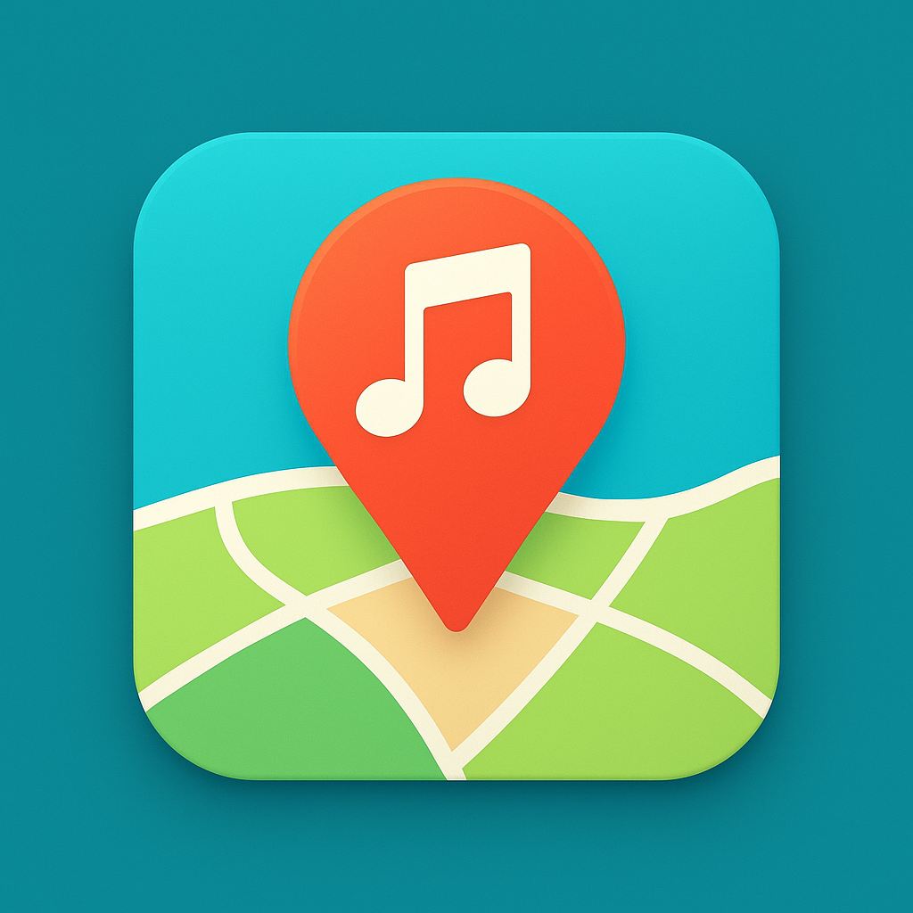

# Music Map by Yacchi

**Your music listening journey, mapped and private.**

MusicMap is an iOS app that lets you log the songs you're listening to along with your location, and discover new music around you. Create a beautiful visual diary of your musical experiences across different places and times.

## Download Link

https://apps.apple.com/app/music-map-by-yacchi/id6755609085

## 🎉 What's New in Version 1.1

### ☕ Cafe Mode - Automatic Music Discovery
Discover and save songs playing around you automatically using Apple's ShazamKit technology:
- **Auto-Discovery** - Identifies background music every 2 minutes when enabled
- **Instant Recognition** - Tap "Discover Now" for immediate song identification
- **Perfect for Cafes** - Great for restaurants, shops, or anywhere you hear music you love
- **Album Artwork** - Discovered songs automatically include beautiful album covers

### 🎨 Album Artwork
View stunning album covers for every logged song in the detail view. Songs discovered through Cafe Mode include artwork automatically, and songs from your music library are saved with their album art.

### 📍 Songs Near Me
Sort your music logs by distance from your current location. Perfect for rediscovering songs you heard in your neighborhood or finding music from nearby places you've visited.

### 🗺️ Smart Dynamic Map Pins
Map pins now intelligently adapt to your zoom level:
- Zoom out to see an overview with larger spacing between pins
- Zoom in close to reveal detailed clusters of nearby songs
- Perfect view at every zoom level with automatic size and density adjustments

## 🔒 Privacy First

**Your data belongs to you. Period.**

- ✅ **100% Local Storage** - All your music logs are stored exclusively on your device using UserDefaults
- ✅ **No External Servers** - Your music logs never leave your device (see Cafe Mode note below)
- ✅ **No iCloud Sync** - Your data never syncs to iCloud, staying completely private
- ✅ **No Third-Party Libraries** - Built entirely with Apple's native frameworks
- ✅ **No Analytics or Tracking** - We don't collect, analyze, or share any of your information

**I will never sell your data.** This app is built with respect for your privacy and your right to keep your listening habits personal.

### Cafe Mode & Privacy

When using Cafe Mode, the app uses Apple's ShazamKit to identify songs:
- **Audio is never recorded or stored** - Only analyzed in real-time on your device
- **Irreversible fingerprints** - ShazamKit creates audio "signatures" that cannot be converted back to audio
- **Apple receives** - Only the audio fingerprint, your IP address, and optionally location for song matching
- **You control it** - Turn Cafe Mode on or off anytime; audio analysis only happens when active
- **Local storage** - Identified songs and metadata are saved on your device only

For complete details, see Apple's [Shazam Music Recognition Privacy Policy](https://www.apple.com/legal/privacy/data/en/music-recognition/)

## ✨ Features

### 📱 Core Functionality
- **Instant Logging** - Capture your current song and location with a single tap
- **Cafe Mode** - Automatically discover songs playing around you with ShazamKit
- **Smart Music Integration** - Works with Apple Music's system player
- **Beautiful Maps** - See all your logged locations on an interactive map
- **Dynamic Map Pins** - Pins adapt intelligently to your zoom level
- **Album Artwork** - Stunning album covers for every logged song
- **Songs Near Me** - Sort by distance from your current location
- **Time-Based Colors** - Markers change color based on the sun's position at that time and place
- **Solar Time Tracking** - Accurate sunrise/sunset calculations for each location

### 🎨 Visual Design
- **Solar Color Coding** - Each log is colored based on actual sunrise/sunset times:
  - 🌃 Deep Night - Deep blue
  - 🌅 Before Sunrise - Lightening blue
  - 🌄 Sunrise - Blue to orange transition
  - ☀️ Day - Bright yellow-orange
  - 🌆 Before Sunset - Deepening orange
  - 🌇 Sunset - Orange to blue transition
  - 🌙 Night - Transitioning to deep blue

- **Location-Aware Solar Times** - Colors reflect the actual light conditions at that specific location and time
- **Smart Marker Filtering** - Prevents overlapping markers on the map with intelligent spacing

### 🗺️ Views
- **List View** - Chronological list or sort by distance from current location
- **Map View** - Interactive map showing all your logged locations with dynamic pins
- **Detail View** - Full information for each log with album artwork and ability to replay the song
- **Solar Time Legend** - Helpful guide explaining the color-coding system
- **Cafe Mode** - Dedicated interface for discovering music around you

## 📋 Requirements

- iOS 18.0 or later
- Location Services permission
- Microphone permission (for Cafe Mode)
- Apple Music (for playing songs)

## 🛠️ Technical Details

Built with modern iOS development practices:
- **SwiftUI** - Modern declarative UI framework
- **@Observable** - New iOS 17+ observation framework
- **CoreLocation** - Precise location tracking
- **MapKit** - Beautiful native maps
- **MediaPlayer** - Apple Music integration
- **ShazamKit** - Audio recognition for Cafe Mode

### Architecture
- `LocationLogger.swift` - Core location and data management
- `MusicLog.swift` - Data model for music logs
- `ContentView.swift` - Main tab view and list interface
- `MapView.swift` - Interactive map with solar time colors and dynamic pins
- `DetailView.swift` - Individual log details with album artwork and playback
- `CafeModeView.swift` - Song discovery interface
- `MusicMapApp.swift` - App entry point

## 🎯 How It Works

### Manual Logging
1. **Play Music** - Start playing a song in Apple Music
2. **Log Location** - Tap the "Log Current Location" button
3. **View on Map** - Switch to the Map tab to see your logged locations
4. **Explore Details** - Tap any marker or list item to see full details with album artwork
5. **Replay Songs** - Tap the play button in detail view to replay songs from your library

### Cafe Mode (Auto-Discovery)
1. **Enable Cafe Mode** - Turn on Cafe Mode in the app
2. **Auto-Discovery** - The app automatically identifies songs every 2 minutes
3. **Instant Recognition** - Or tap "Discover Now" for immediate identification
4. **View Discoveries** - All discovered songs appear in your list with album artwork
5. **Explore on Map** - See where you discovered each song on the map

## 🔐 Permissions

MusicMap requires:
- **Location** (When In Use) - To log your current location
- **Microphone** (When Cafe Mode is Active) - To identify songs playing around you
- **Media Library** (Optional) - To replay songs from your Apple Music library

All permissions are requested only when needed and clearly explained.

## 📊 Data Storage

All data is stored locally using:
- **UserDefaults** - Simple, secure, local-only storage
- **JSON Encoding** - Efficient data serialization
- **No Cloud Sync** - Your data stays on your device

Data includes:
- Song name and artist
- Album artwork (when available)
- Location coordinates (latitude/longitude)
- Timestamp
- Unique identifier
- Discovery method (manual or Cafe Mode)

## 🗺️ Solar Time Calculation

The app calculates precise sunrise and sunset times for each logged location using:
- Solar declination based on day of year
- Hour angle calculations
- Latitude-based adjustments
- Timezone conversions
- Smooth color transitions during twilight periods

This ensures that colors accurately represent whether it was light or dark at that specific place and time.

## 🙏 Acknowledgments

Built with Apple's native frameworks:
- SwiftUI
- CoreLocation
- MapKit
- MediaPlayer
- ShazamKit

Special thanks to Apple for providing ShazamKit for audio recognition.

## ⚠️ Disclaimer

This app:
- Accesses Apple Music's system player for manual logging
- Uses Apple's ShazamKit for song discovery in Cafe Mode
- Does not have access to Apple Music's streaming catalog directly
- Songs must be in your library to play, or you can use the app to open Apple Music to search

When using Cafe Mode, audio fingerprints are sent to Apple's servers for song identification. See our Privacy Policy for complete details.

---

**Made with ❤️ for music lovers who value their privacy**

*Your listening habits are personal. This app ensures they stay that way.*
